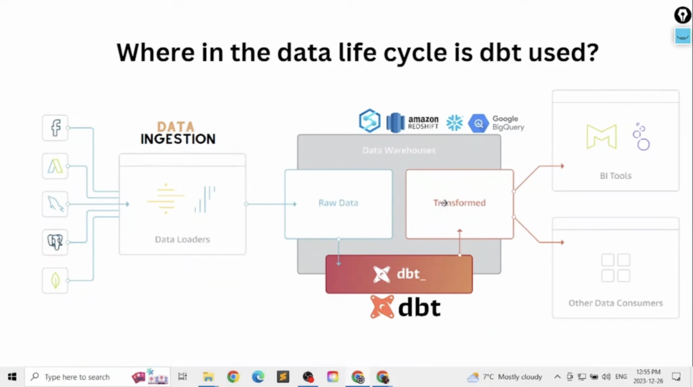
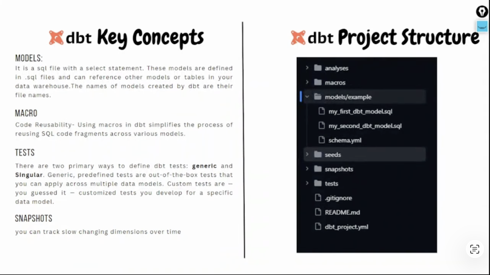

# Data Build Tool (DBT)
## What is DBT 

- dbt is part of elt 
- dbt takes care of the transformation part of elt 
- with dbt users can write sql queries that transform data and create repeatable workflows that can be easily tested and automated 
- designed for modern data stack architecture 

## Limitations of DBT 
- DBT is not a data ingestion or loading tool
- its not BI tool 
- DBT does not store data 
- its not function as a compute processing 

## DBT Products 

### DBT core 
- Colletcion of Python Packages
- Interact via CLI 
- Handles documentations, testing, Sql files etc 

### DBT Cloud 
- its the cloud version of dbt core with extra functionality 
- Its build on top of dbt core 
- Web based products that allows us to schedule jobs & can be used as IDE 

## DBT data life cycle 

## DBT Key Concepts 

### Models 
- A dbt model is a SQL file that defines how to transform data, and dbt materializes it as a table/view 

### Macro

#### Jinja 
- Jinja is a template engine used to generate text files dynamically using logic (variables, loops, conditions).

- A macro is a reusable SQL-generating function written in jinja 

- a dbt macro is jinja function that generates sql at compile time. 

- Using macros in dbt simplifies the process of reusing SQL code fragments across various models 

### Tests
- There are two primary ways to define dbt tests: generic and singular/Custom. 

- Generic predefined tests are out of the box tests that you can apply across multiple data models. 

- Singular/Custom tests are customized tests you develop for a specific model 

### Snapshots 
- You can track slow changing dimensions over time

 